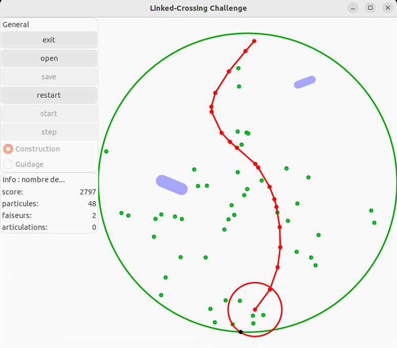

# linkedcrossing
The project has been developed during a second semester of epfl by MichałPtak and Isa Miquel Llosas. It consists in a 2D game where the user has to connect the dots on the opposite sides of a circle, while avoiding the predators. The tools used:
- C++
- Gtkmm
- Makefile
- Git 

